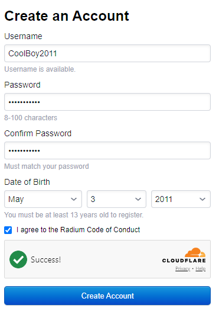
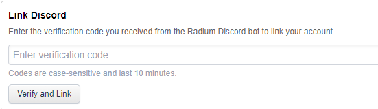
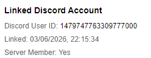

# HOW TO INSTALL AND PLAY RADIUM PROPERLY

## Section 1: Actually Downloading the Game
In order to download Radium, join the [Radium](https://discord.gg/radium-rr) Discord server.
After you've done that, go to the `#💾｜download` channel and download Radium:
- .ipa files are for iOS
- .zip/.dll files are for Windows

### If you'd like to get Radium for Oculus/Quest

### Verify your Meta account
Run `/verify-oculus` in the `⁠#🤖｜bot-commands` channel using the username or email associated with your Meta account. (Don't just say `/verify-oculus`)

**Note:** Meta usernames are case-sensitive. Make sure you enter your username **exactly** as it appears on your Meta account.

#### Example:
If your username is `CoolBoy2011`, enter `CoolBoy2011` and **NOT** `COOLBoy2011`, `CoolBOY2011` or anything else.

### Accept the invite
Check your email for an invitation from *RecRoomArchive* and accept it.

### Install and play
Put on your headset and look for **Radium** in your Quest app library.
If it doesn't appear right away, try restarting your headset.

This is a temporary solution while the Radium team waits for **App Lab** approval, which will make installation easier in the future.

## Section 2: Creating an Account
Go to [Radium's Website](https://radie.app) and click *Sign Up*<br>
**Enter your username, password, and date of birth.**

### It should look something like this:


Once you're done, click **Create Account!**
### Congratulations, you've just made a Radium account!

## Section 3: Linking Your Discord Account
You're not ready to play Radium yet! You still have to link your Discord account.

### Getting a verification code 
Go to #🤖｜bot-commands and run `/link` (Don't just say `/link`, also the command should have the Radium icon next to it), the bot should give you an verification code. **DO NOT SHARE IT ANYWHERE!**

> [!note]
> If the Radium bot doesn't respond, then it's most likely offline.
> Please be patient while the Radium team tries to fix this issue.

### Using the verification code
Go to [the settings page](https://www.radie.app/my/settings) and enter your verification code under *Link Discord*



Once you're done, press **Verify and Link**, to verify that your account has been linked, look for something like this:



If it doesn't seem to show a user ID, try again or contact Radium support.

## Section 4: Adding Exclusions to Windows Defender
### This was added because some people don't understand that not every detection is malware.<br>
**If you aren't on Windows, you can skip this section.**<br>
### MAKE SURE TO EXTRACT THE ZIP FILE AFTER YOU'VE DISABLED WINDOWS DEFENDER!!

### Disabling real-time protection and tamper protection
First, temporarily disable Windows Defender by opening *Windows Security*, then navigate to **Virus & threat protection**, and under **Virus & threat protection settings** click **Manage setttings**. then turn off both **Real-time protection** and **Tamper protection**, accept any UAC prompts.

### If you'd like to use PowerShell
First, check the current state:
```pwsh
Get-MpComputerStatus
```
Look at the `IsTamperProtected` line.<br>
**If IsTamperProtected is True, disable it using Windows Security (PowerShell doesn't let you disable Tamper Protection)**

After that, disable real-time monitoring:
```pwsh
Set-MpPreference -DisableRealtimeMonitoring $true
```

To re-enable (run this after you're done):
```pwsh
Set-MpPreference -DisableRealtimeMonitoring $false
```

**Don't worry, Radium is safe. Any detections from antiviruses are false positives!**

### Adding exclusions
First, open *Windows Security*, navigate to **Virus & threat protection**, and under **Virus & threat protection settings** click **Manage setttings**, however this time, scroll down until you find **Exclusions**.

Once you've found that, click **Add or remove exclusions**.

On the Exclusions page, click **Add exclusion**, select **Folder**, browse to your Radium folder, then click **Open**.

### If you'd like to use PowerShell
```pwsh
Add-MpPreference -ExclusionPath "C:\path\to\your\radium\folder"
```
(Replace `C:\path\to\your\radium\folder` with your Radium folder's path, obviously)

**MAKE SURE TO ENABLE REAL-TIME PROTECTION AND TAMPER PROTECTION ONCE YOU'VE ADDED THE EXCLUSIONS!!**

## Section 5: The Last One
We've finally gone through the boring steps, now it's time to play Radium!

First, find your Radium folder, you should see three `.bat` files:
- `RecRoom_ScreenMode.bat` - Run this if you're playing on PC without a VR.
- `RecRoom_VR.bat` - Run this if you're playing on PCVR.
- `RecRoomLog.bat` - Opens `%APPDATA%\..\LocalLow\Against Gravity\Rec Room`, most likely to view the game's logs. This doesn't launch Rec Room.

Once you're in Rec Room, click **Sign in to an existing Rec Room account**, you **MUST** use this button as the **Create Account** button doesn't work properly (from what I've heard), besides, you've already made a Radium account! Why make another one?

Enter your username and password, check **Remember Password** (recommended) and click **Sign In**.

# Congratulations! You've successfully joined Radium!
You should be proud of yourself! Most people just don't read, so the fact that you got **THIS** far is very surprising!
If you have any issues, you can go to the `#❓｜help` channel and explain your issue.
